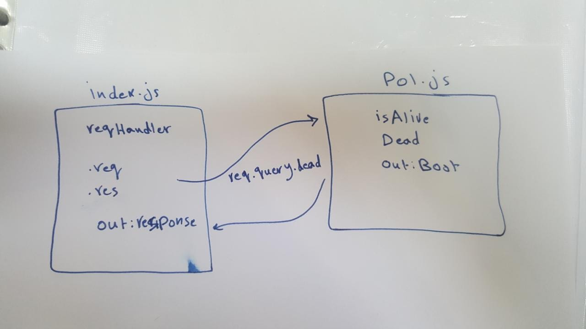

# LAB - Class 00

## Project: Proof of Life Server

### Author: Anas Zain

### Links and Resources

- [submission PR](https://github.com/401-advanced-javascript-anas/lab-00/pull/1)
- [ci/cd](https://travis-ci.org/github/401-advanced-javascript-anas/lab-00/jobs/687796991) (GitHub Actions)
- [back-end server url](http://xyz.com) (when applicable)
- [front-end application](https://anas-lab-00.herokuapp.com/) (when applicable)

#### Documentation

[jsdoc](https://anas-lab-00.herokuapp.com/docs/)

### Setup

#### `.env` requirements (where applicable)

i.e.

- `PORT` - Port Number
- `MONGODB_URI` - URL to the running mongo instance/db

#### How to initialize/run your application (where applicable)

- e.g. `npm start`

- Endpoint: '/'
 - returns a boolean
- Endpoint: '/docs'
 - Returns JSdoc Documentation Pages. 
#### How to use your library (where applicable)

#### Tests

- How do you run tests? `npm test` , `npm run lint`
- Any tests of note? `Need to test xyz...`
- Describe any tests that you did not complete, skipped, etc

#### UML

Link to an image of the UML for your application and response to events
